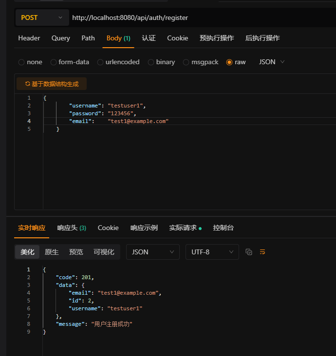
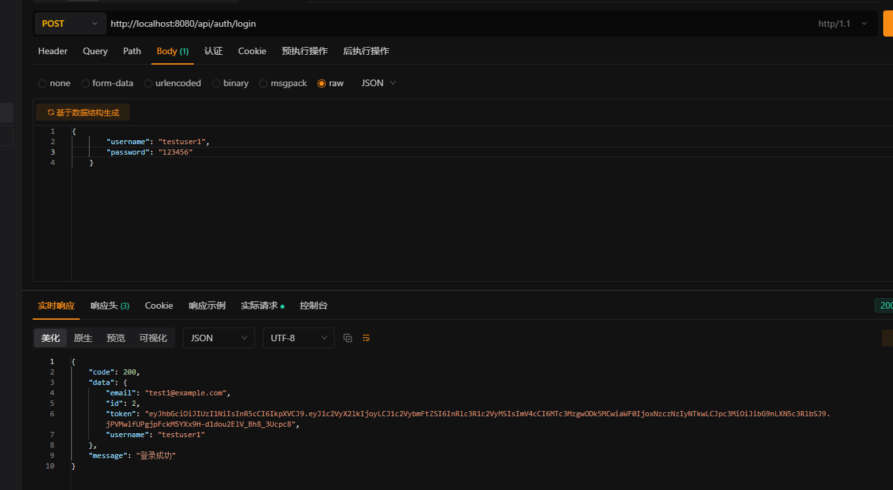
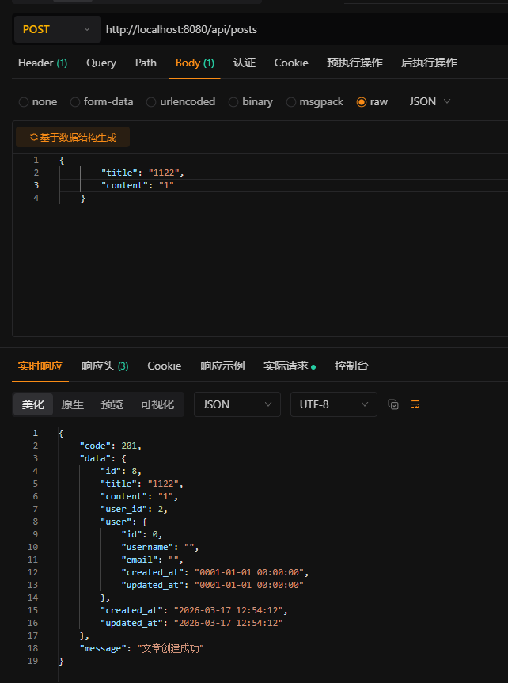
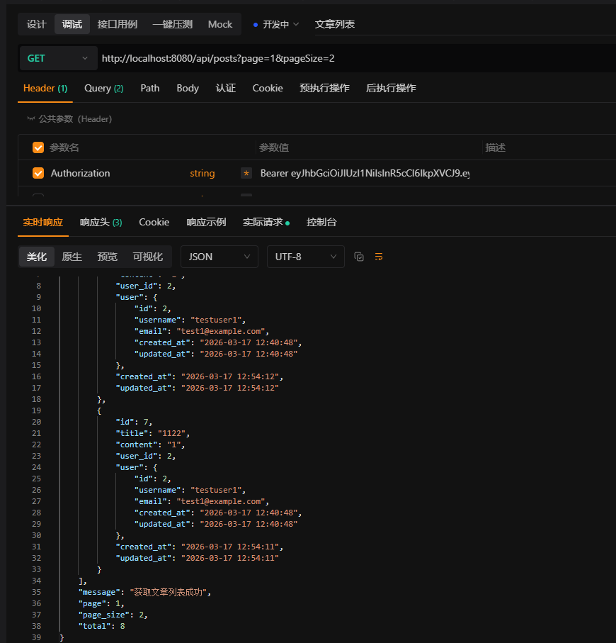
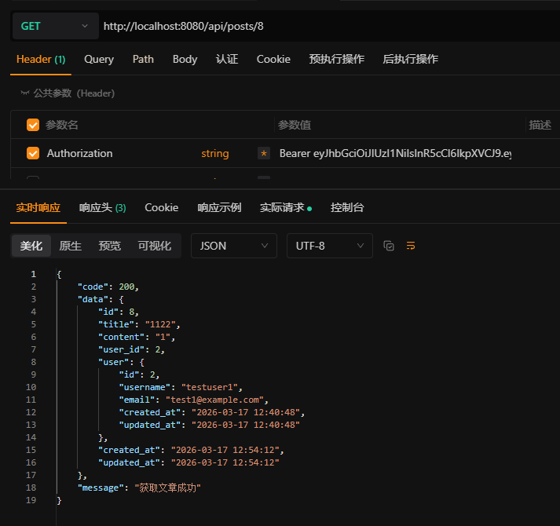
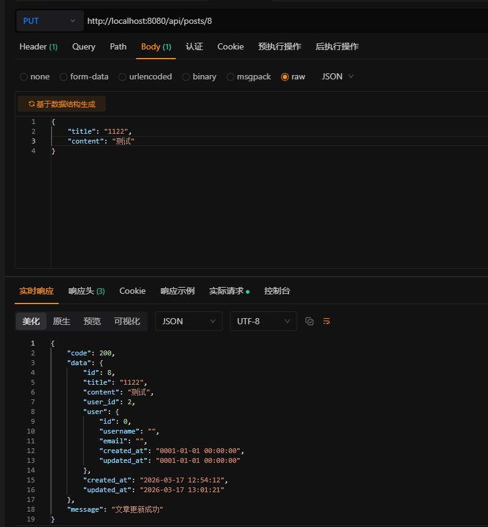
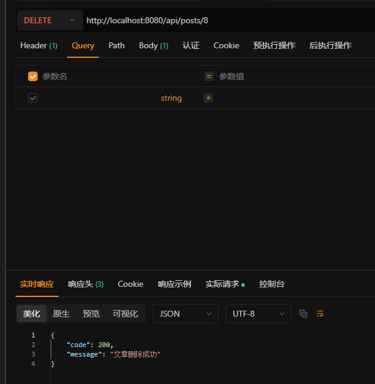
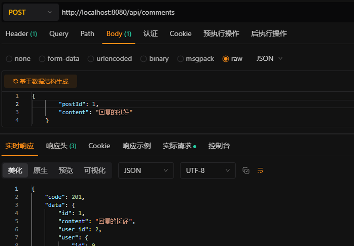
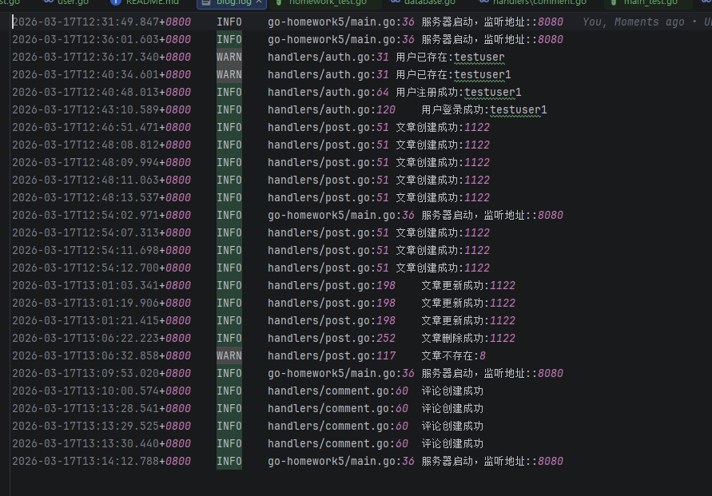

NEW_FILE_CODE
# Go 博客系统

基于 Gin 框架和 GORM 开发的博客系统 API。

## 功能特性

- ✅ 用户注册和登录
- ✅ JWT 认证和授权
- ✅ 密码加密存储（bcrypt）
- ✅ 文章管理（创建、读取、更新、删除）
- ✅ 评论功能
- ✅ 权限控制（只能操作自己的文章）
- ✅ 统一错误处理
- ✅ 日志记录

## 项目结构
go-homework5/
├── config/          # 配置模块
│   ├── database.go  # 数据库配置
│   └── logger.go    # 日志配置
├── handlers/        # HTTP处理器
│   ├── auth.go      # 认证处理器
│   ├── post.go      # 文章处理器
│   ├── comment.go   # 评论处理器
│   └── user.go      # 用户处理器
├── middleware/      # 中间件
│   └── auth.go      # JWT认证中间件
├── models/          # 数据模型
│   ├── user.go      # 用户模型
│   ├── post.go      # 文章模型
│   └── comment.go   # 评论模型
├── pkg/             # 工具包
│   └── jwt/
│       └── jwt.go   # JWT工具函数
├── routes/          # 路由配置
│   └── router.go    # 路由设置
├── logs/            # 日志目录（运行时自动创建）
├── main.go          # 程序入口
├── go.mod           # 依赖管理
├── homework_test.go # 单元测试
└── README.md        # 项目文档
()
# 1. 进入项目目录
cd go-homework5

# 2. 安装依赖
go mod tidy

# 3. 运行项目
go run main.go

# 4. 运行测试
go test -v

# 注册

# 登录

# 创建文章

# 文章列表

# 单个文章

# 编辑文章

# 删除文章

# 评论创建

# 错误处理与日志记录
