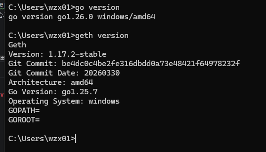
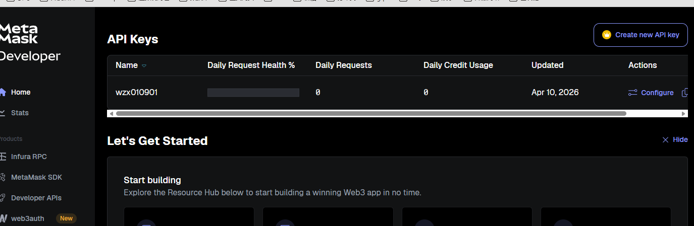
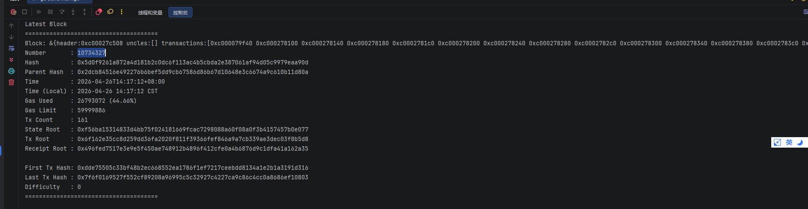
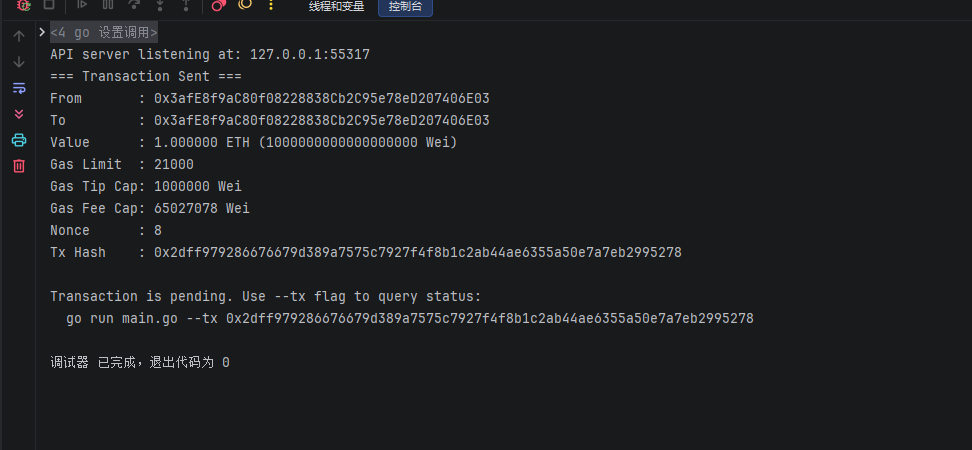

# Go 区块链作业 - Homework 5

本项目实现了使用 Go 语言与以太坊 Sepolia 测试网络进行交互的功能，包括区块链读写和智能合约交互。

---

## 任务 1：区块链读写

### 任务目标
使用 Sepolia 测试网络实现基础的区块链交互，包括查询区块和发送交易。

### 具体任务

#### 1. 环境搭建
- 安装必要的开发工具，如 Go 语言环境、go-ethereum 库。

- 注册 Infura 账户，获取 Sepolia 测试网络的 API Key。

#### 2. 查询区块
- 编写 Go 代码，使用 ethclient 连接到 Sepolia 测试网络。
- 实现查询指定区块号的区块信息，包括区块的哈希、时间戳、交易数量等。
- 输出查询结果到控制台。

#### 3. 发送交易
- 准备一个 Sepolia 测试网络的以太坊账户，并获取其私钥。
- 编写 Go 代码，使用 ethclient 连接到 Sepolia 测试网络。
- 构造一笔简单的以太币转账交易，指定发送方、接收方和转账金额。
- 对交易进行签名，并将签名后的交易发送到网络。
- 输出交易的哈希值。

---

## 任务 2：合约代码生成

### 任务目标
使用 abigen 工具自动生成 Go 绑定代码，用于与 Sepolia 测试网络上的智能合约进行交互。

### 具体任务

#### 1. 编写智能合约
- 使用 Solidity 编写一个简单的智能合约，例如一个计数器合约。
- 编译智能合约，生成 ABI 和字节码文件。

